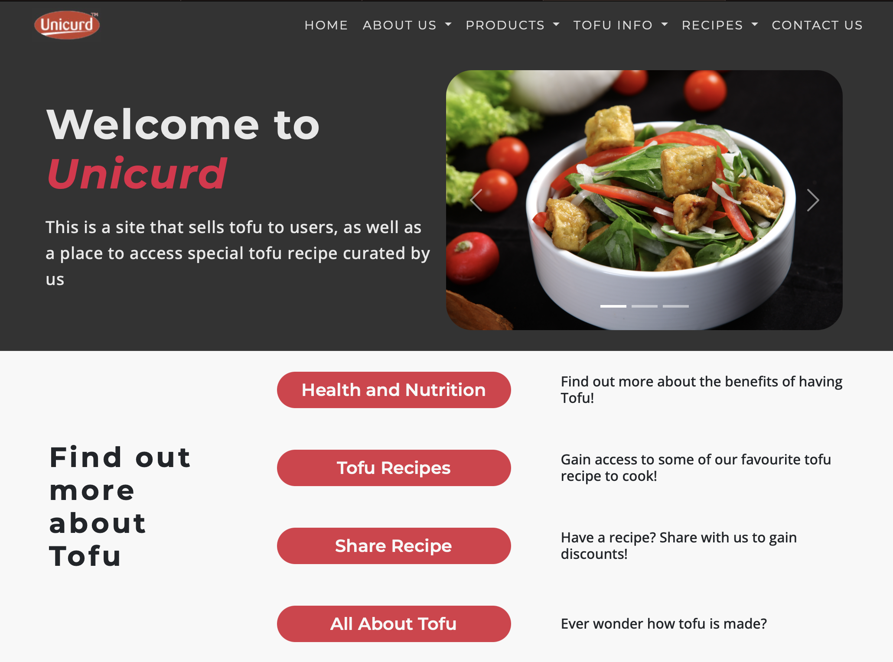
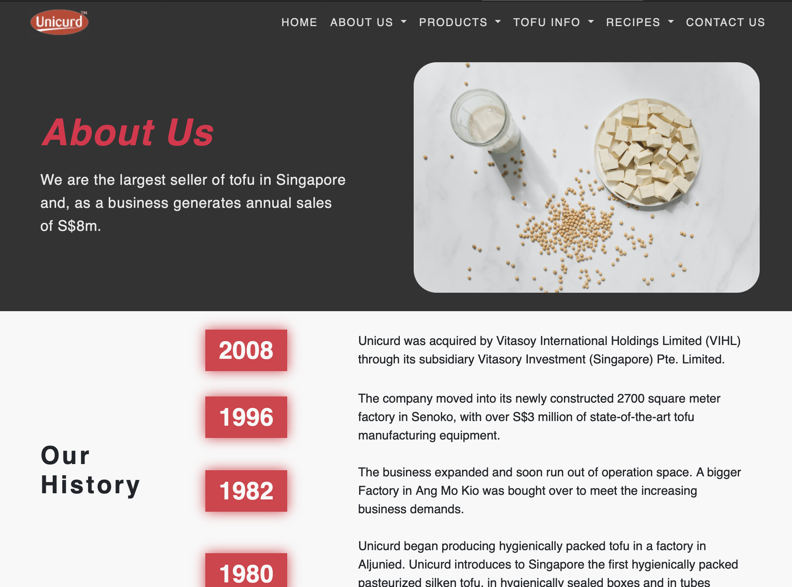

# Learn Bootstrap #

## 👨‍💻 This is a mini project that revamps the [**Unicurd website**](http://www.unicurd.com.sg) ###

### Tech used: ###

&nbsp;&nbsp;&nbsp;&nbsp;
 
 

### 🌐 Project URLs: 
* [Unicurd - Home](https://nicholas5538.github.io/learn-bootstrap/index.html)
* [Unicurd - About Us](https://nicholas5538.github.io/learn-bootstrap/about-us.html)
* [Unicurd - Products](https://nicholas5538.github.io/learn-bootstrap/product.html)

### 🥅 Objective & Purpose
1. Using [Unicurd](http://www.unicurd.com.sg) as an example as the webpages are **_not responsive_** and **_not aesthetically modern_**
2. Minimising the usage of CSS stylesheet with Bootstrap framework
### 🖼️ Previews ###

  
   

### 📝 What I have learnt ###
1. Bootstrap
2. Colour theory
3. Always have a mobile first design strategy mindset
4. Media Queries
5. Absolute & Relative Units (%, rem, em)
6. HTML Semantic Elements
7. Flexbox
8. More CSS properties & Pseudo-classes